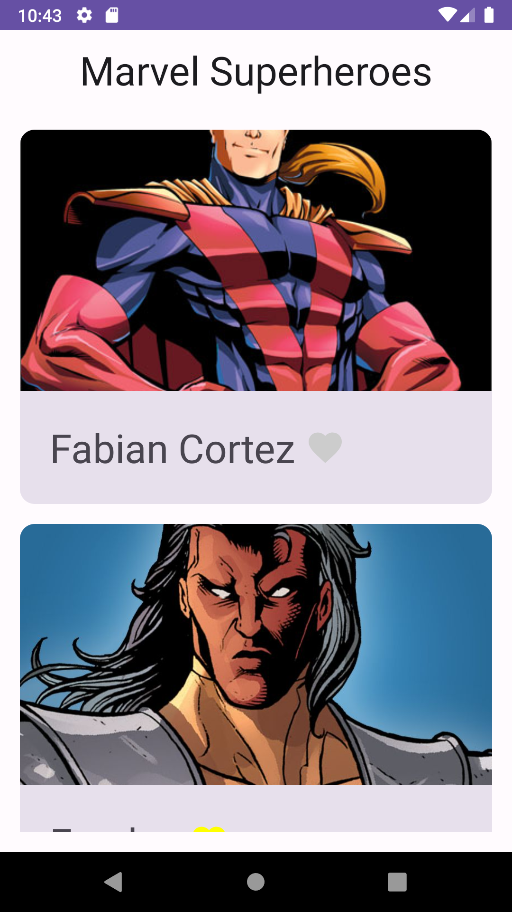
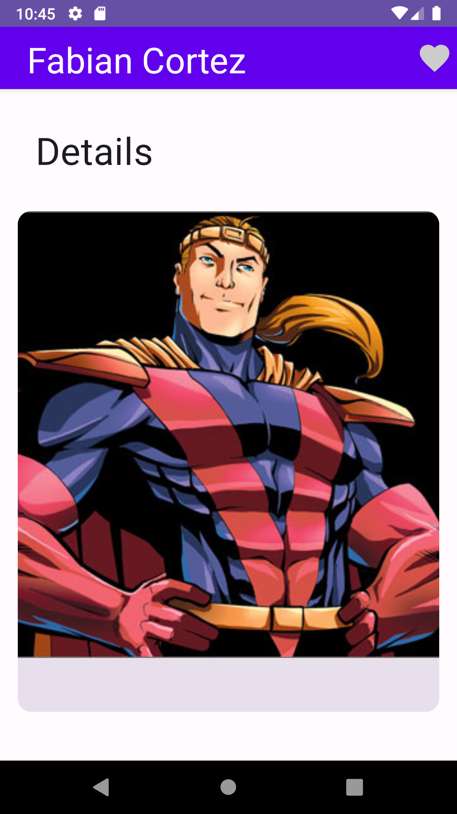
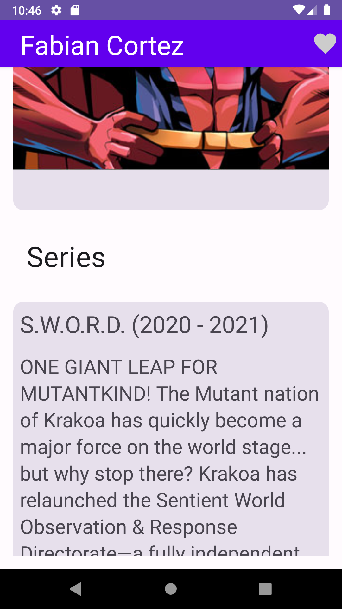

# Android Marvel Superheroes

## Introduction

A bootcamp project involving Jetpack Compose, Kotlin Flow, Room, multiple API endpoint connections, Hilt, testing and SOLID/clean principles.

## Features

The application presents a Marvel hero list using API data. The application will consist of:
* **Hero List**. A list of heroes where a list with the photo and the name will appear.
* **Hero Detail Screen**. A detailed view, showing the hero name, larger photo, description, an option to mark as favorite and series information for the given hero.

When you tap on the Hero, you will see the detail showing:
* Series where the hero appears
* Photo of the series
* Title
* Description
* The user can mark heroes as favorites

## Screenshots

| Hero List                                                              | Hero Detail 1                                                                | Hero Detail 2                                                                 |
|------------------------------------------------------------------------|------------------------------------------------------------------------------|-------------------------------------------------------------------------------|
|  |  |  |